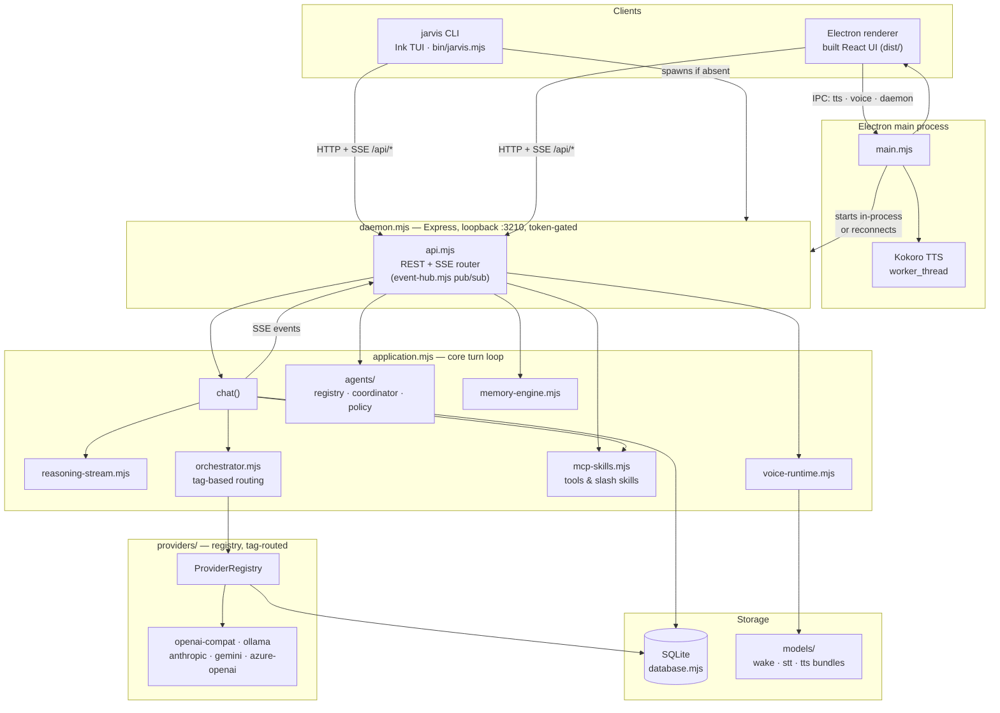

# JARVISvX

Local-first voice and terminal AI assistant. A loopback-only daemon owns SQLite state, provider routing, and an SSE event stream shared by two clients: an Electron voice host and a `jarvis` CLI.

## Getting Started

- **Windows** → [docs/QuickStart-windows.md](docs/QuickStart-windows.md)
- **Linux** → [docs/QuickStart-linux.md](docs/QuickStart-linux.md)

Both cover requirements, install/build, and running the desktop host or CLI for the
first time.

## Guides

- **Desktop GUI, day-to-day operation** → [docs/OperatorsGuide-GUI.md](docs/OperatorsGuide-GUI.md)
- **`jarvis` CLI, day-to-day operation** → [docs/OperatorsGuide-CLI.md](docs/OperatorsGuide-CLI.md)

## Configuration

Copy `.env.example` to `.env` and adjust — it documents every variable (ports,
provider URLs, data directory, cloud credentials) inline.

## Storage Layout

All artifacts are kept inside the repository directory.

| Path | Contents |
|---|---|
| `models/wake` | Wake-word ONNX bundle |
| `models/stt` | Whisper STT bundle |
| `models/tts` | Kokoro TTS bundle |
| `data/sql-db` | SQLite database; daemon lock/discovery file while running |
| `data/electron-profile` | Durable Electron user profile |
| `cache/` | Re-creatable runtime state (`cache/temp` = download staging) |

No data is written to `%APPDATA%` or a home-directory folder — this holds regardless of
the working directory `jarvis` is launched from, since defaults are anchored to the
install directory, not the current shell's cwd. (The one unrelated exception is npm's
own global `jarvis` command shim under `%APPDATA%\npm`, created by `npm link` itself —
see the `npm link` troubleshooting note in [docs/QuickStart-windows.md](docs/QuickStart-windows.md).)

## Providers

| Provider | Transport | Notes |
|---|---|---|
| llama.cpp / llama.app | Local HTTP | Default; no approval required |
| Ollama | Local HTTP | Default; no approval required |
| OpenAI-compatible cloud | HTTPS | Requires explicit per-turn `/approve-cloud` |

## Architecture

The daemon is the only process that touches SQLite or the provider
registry; both clients — the CLI and the Electron renderer — reach it
exclusively over loopback HTTP/SSE, authenticated by a per-process token
(`x-jarvis-token`). Electron's main process is a special case: it can start
the daemon in-process instead of over HTTP, and separately runs a Kokoro
TTS worker thread that the renderer drives directly over IPC (not through
the daemon).

**lib/** modules: `application`, `daemon`, `database`, `diagnostics`, `event-hub`, `mcp-skills`, `memory-engine`, `model-bootstrap`, `orchestrator`, `providers/` (provider registry, tag-based routing), `reasoning-stream`, `tools`, `voice-runtime`, `voice-transcript`, `api`.

## Safety

- Workspace tools are **read-only**: approved root required, UTF-8 text only, 1 MiB limit per read.
- Workspace file writes always go through a proposal/approval queue — JARVIS never writes a file without an explicit per-edit operator approval.
- JARVIS does not auto-execute LLM-generated code or retain raw microphone audio. Operators can add custom skills (authored directly or imported from `skills.sh`), and that code runs only when explicitly invoked.
- Cloud turns require explicit in-session approval (`/approve-cloud`).

## Contributing

Conventions for documentation, testing scope, git, commands, and completion
reporting live in [AGENTS.md](AGENTS.md).

## License

MIT — see [LICENSE](LICENSE).

