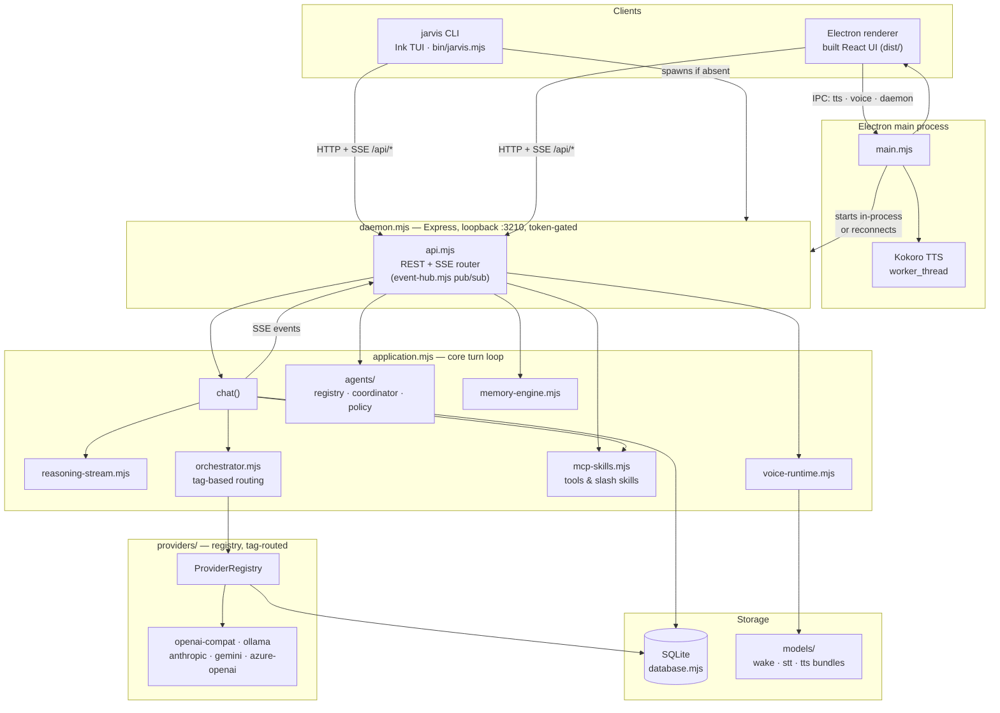

# JARVISvX

Local-first voice and terminal AI assistant. A loopback-only daemon owns SQLite state, provider routing, and an SSE event stream shared by two clients: an Electron voice host and a `jarvis` CLI.

## Requirements

- **Node.js** ≥ 24.15
- **LLM runtime** — llama.cpp / llama.app (`http://127.0.0.1:8080`) or Ollama (`http://127.0.0.1:11434`)
- **Windows** — microphone permission required for the Electron host

## Quick Start

```powershell
npm install
npm update
npm run build

# Desktop (Electron voice host)
npm run desktop

# CLI
npm link
jarvis
```

`jarvis` attaches to a running daemon or starts the Electron host if none is found.

> **`npm link` fails with `EEXIST ... AppData\Roaming\npm\jarvis`?** That's npm's own
> global command shim, not JARVIS data — it's written once per machine the first time
> you link, and re-cloning or deleting the repo doesn't clear it, so a second `npm link`
> (from this clone or any other) collides with the one already there. Fix once with:
> ```powershell
> npm uninstall -g jarvis
> npm link
> ```
> (or `npm link --force` to overwrite it directly). This is unrelated to the app's own
> storage — see [Storage Layout](#storage-layout) — which always stays inside the repo.

## Usage

### Desktop

```powershell
npm run desktop
```

Runs the Electron voice host: wake-word listening → microphone capture → Whisper transcription → model streaming → Kokoro TTS playback. Closing the window hides to tray; use **Quit** from the tray menu to exit.

First run downloads wake-word, Whisper, and Kokoro model bundles into `models/`. Default voice: `bf_isabella`.

### CLI

```powershell
jarvis                                    # interactive REPL
jarvis ask "summarize this project"       # one-shot
jarvis doctor                             # check daemon, providers, models
jarvis daemon                             # start daemon in foreground
jarvis workspace add E:\WORK\CODE\REPO\JARVISvX
```

**Interactive commands:**

```
/new  /sessions  /resume  /provider  /model  /voice  /listen  /mute  /interrupt
/doctor  /workspace  /settings  /approve-cloud  /help  /exit
```

### Development

```powershell
npm run dev          # start daemon (server.mjs, port 3210)
npm run build        # vite build → dist/
npm test             # Node built-in test runner
npm run lint         # tsc --noEmit
```

`npm run dev` starts only the daemon — not Vite or a second process. Build before running the desktop host if `dist/` is absent.

## Configuration

Copy `.env.example` to `.env` and adjust as needed:

```env
JARVIS_PORT=3210
JARVIS_LLAMACPP_URL=http://127.0.0.1:8080/v1
JARVIS_OLLAMA_URL=http://127.0.0.1:11434

# Optional — requires explicit per-turn approval
JARVIS_CLOUD_URL=
JARVIS_CLOUD_MODEL=
JARVIS_CLOUD_API_KEY=
```

## Storage Layout

All artifacts are kept inside the repository directory.

| Path | Contents |
|---|---|
| `models/wake` | Wake-word ONNX bundle |
| `models/stt` | Whisper STT bundle |
| `models/tts` | Kokoro TTS bundle |
| `data/sql-db` | SQLite database; daemon lock/discovery file while running |
| `data/electron-profile` | Durable Electron user profile |
| `cache/` | Re-creatable runtime state (`cache/temp` = download staging) |

No data is written to `%APPDATA%` or a home-directory folder — this holds regardless of
the working directory `jarvis` is launched from, since defaults are anchored to the
install directory, not the current shell's cwd. (The one unrelated exception is npm's
own global `jarvis` command shim under `%APPDATA%\npm`, created by `npm link` itself —
see the Quick Start note above.)

## Providers

| Provider | Transport | Notes |
|---|---|---|
| llama.cpp / llama.app | Local HTTP | Default; no approval required |
| Ollama | Local HTTP | Default; no approval required |
| OpenAI-compatible cloud | HTTPS | Requires explicit per-turn `/approve-cloud` |

## Architecture



The daemon is the only process that touches SQLite or the provider
registry; both clients — the CLI and the Electron renderer — reach it
exclusively over loopback HTTP/SSE, authenticated by a per-process token
(`x-jarvis-token`). Electron's main process is a special case: it can start
the daemon in-process instead of over HTTP, and separately runs a Kokoro
TTS worker thread that the renderer drives directly over IPC (not through
the daemon).

**lib/** modules: `application`, `daemon`, `database`, `diagnostics`, `event-hub`, `mcp-skills`, `memory-engine`, `model-bootstrap`, `orchestrator`, `providers/` (provider registry, tag-based routing), `reasoning-stream`, `tools`, `voice-runtime`, `voice-transcript`, `api`.

## Safety

- Workspace tools are **read-only**: approved root required, UTF-8 text only, 1 MiB limit per read.
- JARVIS does not write workspace files, execute generated code, install skills, or retain raw microphone audio.
- Cloud turns require explicit in-session approval (`/approve-cloud`).

## Contributing

Conventions for documentation, testing scope, git, and completion reporting
live in [AGENTS.md](AGENTS.md).

## License

MIT — see [LICENSE](LICENSE).

